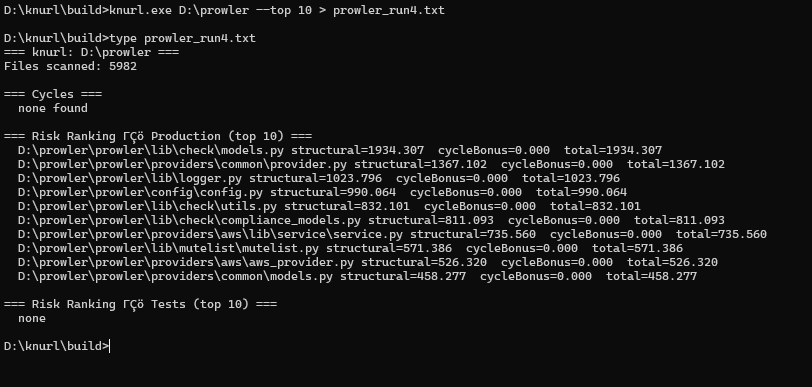
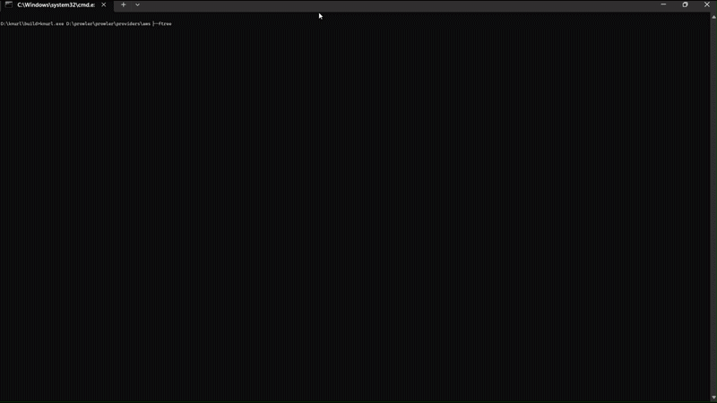

# Knurl

A C++17 command-line static-analysis tool for Python codebases. Knurl
builds an internal dependency graph for a repo, detects import cycles,
answers "what breaks if I change this file," and ranks files by
structural risk — all without regex or an AST.



## What it does

- Builds a full dependency graph from a Python codebase's own imports
- Detects import cycles and shows the full chain
- Impact analysis: given a file, finds everything that depends on it,
  directly or transitively, with hop distance
- Risk ranking: scores files by combining cycle membership and
  downstream blast radius, with production and test files kept separate
- ASCII dependency trees (`--ftree`, `--itree`, `--deptree`)
- `.dot` export for Graphviz

## Demo

Running `--ftree` against a real, ~6,800-file production codebase
(prowler-cloud/prowler):



## Install / Build

Requires CMake 3.16+ and a C++17 compiler. Tested on Linux (GCC) and
Windows (MinGW).

```bash
git clone https://github.com/asraym/knurl.git
cd knurl
mkdir build && cd build
cmake ..
cmake --build .
```

## Usage

```bash
knurl <root_dir> [--target <file>] [--top <N>]
      [--ftree | --itree | --deptree] [--dot <path>]
```

| Flag | Description |
|---|---|
| `--target <file>` | File to run impact analysis on |
| `--top <N>` | Limit risk-ranking output to top N files |
| `--ftree` | Print a whole-repo dependency tree |
| `--itree --target <file>` | Print a reverse-dependency tree rooted at target |
| `--deptree --target <file>` | Print both directions from target |
| `--dot <path>` | Export the dependency graph as a Graphviz `.dot` file |

At most one of `--ftree`/`--itree`/`--deptree` may be given at a time.
`--itree` and `--deptree` require `--target`; `--ftree` does not accept one.

## Usage Tiers

Each import *edge* is classified by how the imported names are
actually used in the importing file — a structural proxy for "how
likely is this code to run," not true call-graph analysis:

- **Tier 1** — referenced at indentation 0 (module top-level) — this
  code runs the moment the module is imported
- **Tier 2** — only referenced inside an indented block (a function,
  method, `if`, etc.) — may or may not ever execute; Knurl has no
  call graph, so this is genuinely unknowable by design, not a gap
  that could be closed cheaply
- **Tier 3** — imported but never referenced again in the file

When a single import statement brings in multiple names, the edge as
a whole takes the *worst* (highest-severity) tier among them —
one Tier-1 usage on an otherwise-unused import still makes the whole
edge Tier 1.

**Known, deliberate blind spot:** class-body statements assigned
directly under `class Foo:` (no `def`) genuinely execute at import
time, but read as indented text to Knurl's indentation-based check, so
they're classified as Tier 2 instead of the "true" Tier 1. This is
documented rather than special-cased, since it's a narrow, low-impact
case relative to the complexity a fix would add.

## Design notes

- **No regex, no AST, anywhere.** All Python parsing is manual,
  line-by-line string handling. This is a hard constraint, not a
  shortcut — it means Knurl has known, documented blind spots rather
  than false confidence from a parser it doesn't fully control.
- **`pkg/__init__.py` collapses to module name `pkg`**, not
  `pkg.__init__`. A root-level `__init__.py` maps to the empty module
  name `""`.
- **Relative imports resolve against the source file's own package**,
  and a package's `__init__.py` counts as *its own* package, not its
  parent's. One dot = the current package itself; each additional dot
  strips one more trailing segment. Dots that land exactly on the
  empty-string root are **valid**, not unresolved — only dots that
  strip *past* an already-empty string count as external.
- **`from X.Y import Z` where `X.Y` is non-empty resolves to module
  `X.Y` only** — `Z` is discarded as a symbol name, never treated as a
  submodule. This is a deliberate file-level (not symbol-level) design
  choice: Knurl can't tell "Z is a submodule" from "Z is a name defined
  inside X/Y/__init__.py" without fully resolving, which is out of
  scope for a static, single-pass tool.
- **Unresolved != error.** External libraries, stdlib modules, and
  genuinely broken references are all bucketed identically as
  "external" — Knurl never tries to distinguish a legitimate
  third-party dependency from a broken import.
- **Determinism is non-negotiable.** `unordered_map`/`unordered_set`
  iteration order is not reproducible across runs or machines, so
  every stage that touches a hash container sorts nodes, neighbors, or
  results explicitly before producing output.
- **Virtual environments are detected by `pyvenv.cfg`**, not by
  matching a fixed list of folder names — this catches any venv
  regardless of what it's called (`venv`, `.venv`, `venv_linux`, etc.).
- **`RiskRanker` measures internal blast radius only** — it has no
  concept of a file being part of a codebase's public API surface,
  because Knurl only sees a repo's own internal import graph, never
  who calls into it from outside. A file can be the most important
  entry point to real users and still score low if few internal
  modules import it back. Documented as a known scope limitation, not
  fixed — a possible future signal (e.g. a bonus for files re-exported
  by `__init__.py`) is an open question, not yet decided.

## Known limitations

- On large repos (~7k files), risk ranking currently takes roughly
  35-45 seconds — the reverse-BFS in `chainSeverity` is recomputed
  per impacted file, per file in the ranking, so it doesn't scale
  linearly. This is a known, documented cost, not a bug; caching the
  reverse-edge index is the natural next optimization if this becomes
  a real bottleneck.
- No output-format flag beyond the existing tree modes and `--dot`.
- Class-body top-level statements are misclassified as Tier 2 instead
  of Tier 1 (see Usage Tiers above) — a documented, deliberate gap.

## Status

Verified end-to-end on Windows (MinGW) and Linux, against a small real
repo (Sklearn-genetic-opt) and a large one (prowler-cloud/prowler,
~6,800 files). See [Releases](../../releases) for tagged versions.

## License

This project is licensed under the MIT License - see the [LICENSE](LICENSE) file for details.
